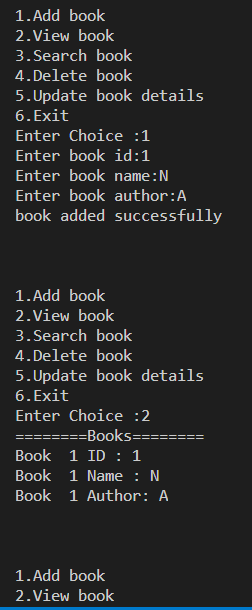

# 📚 Library Management System

A Python-based Library Management System that allows users to manage books through a menu-driven interface.

## Features

* Add Book
* View Books
* Search Book by ID
* Delete Book
* Update Book Details
* Exit Program

## Functions

### menu()

Displays the main menu.

### add_book()

Adds a new book to the library.

### view_book()

Displays all books stored in the system.

### search_book()

Searches for a book using its ID.

### delete_book()

Deletes a book using its ID.

### update_book()

Updates book ID, name, or author.

### main()

Controls the complete program execution.

## Technologies Used

* Python
* Functions
* Lists
* Loops
* Conditional Statements

## Concepts Used

* CRUD Operations
* Linear Search
* List Manipulation
* Input Validation
* Modular Programming

## Sample Output

## Project Structure

Library-Management-System

├── libraryManager.py

├── README.md

├── .gitignore

└── Result.PNG

## Version

Current Version: v1.0

## Author

Lokesh Sangdoya

B.Tech CSE (AI & ML)
